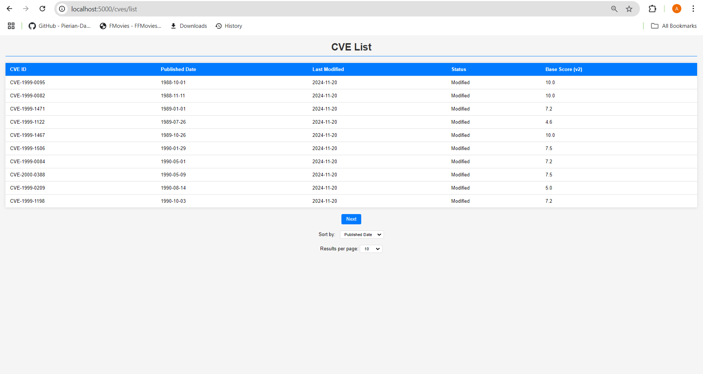
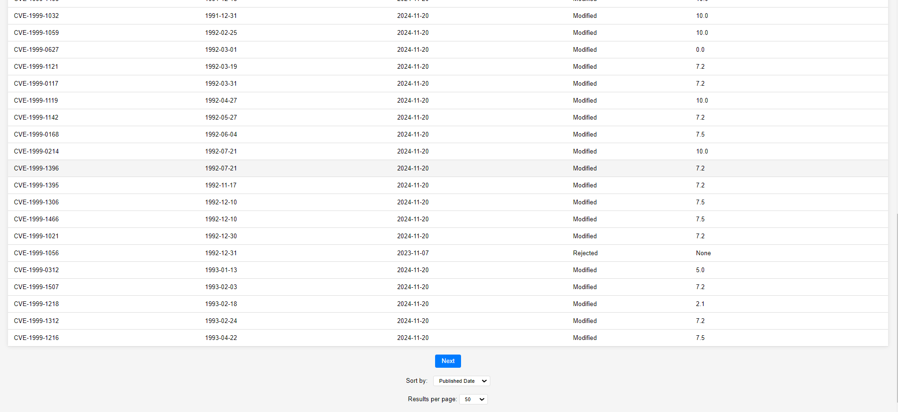
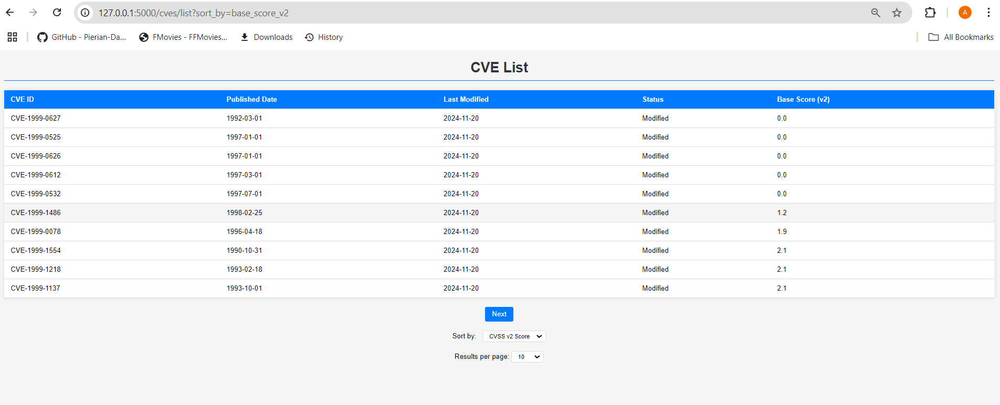
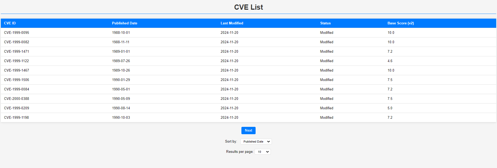
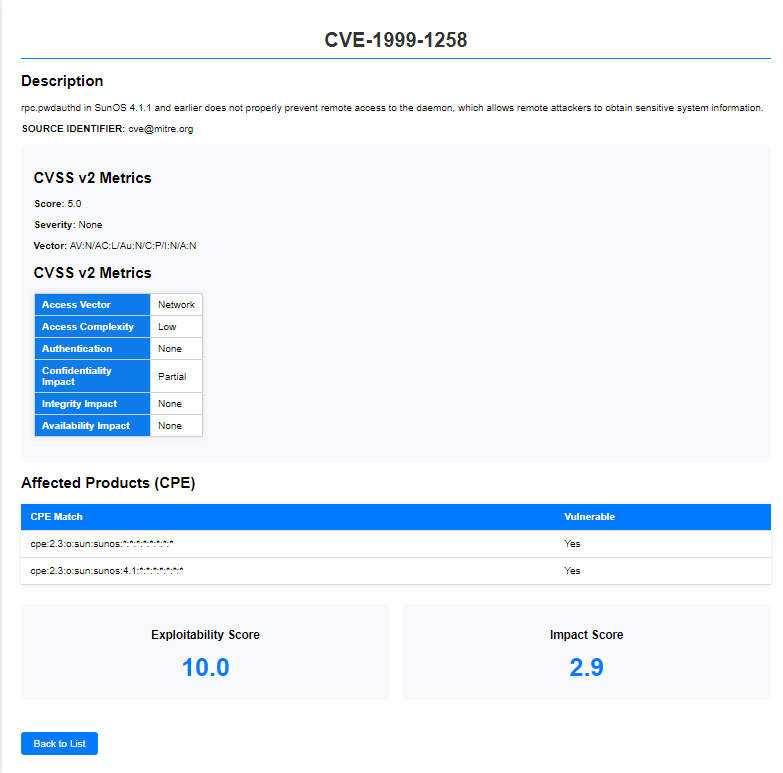
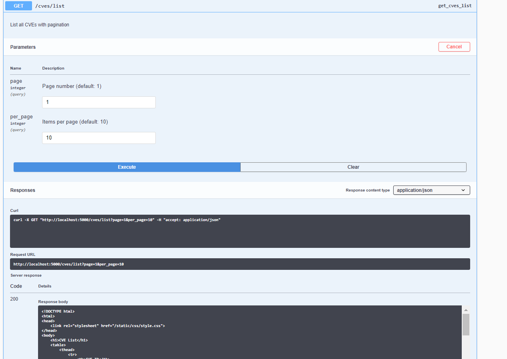
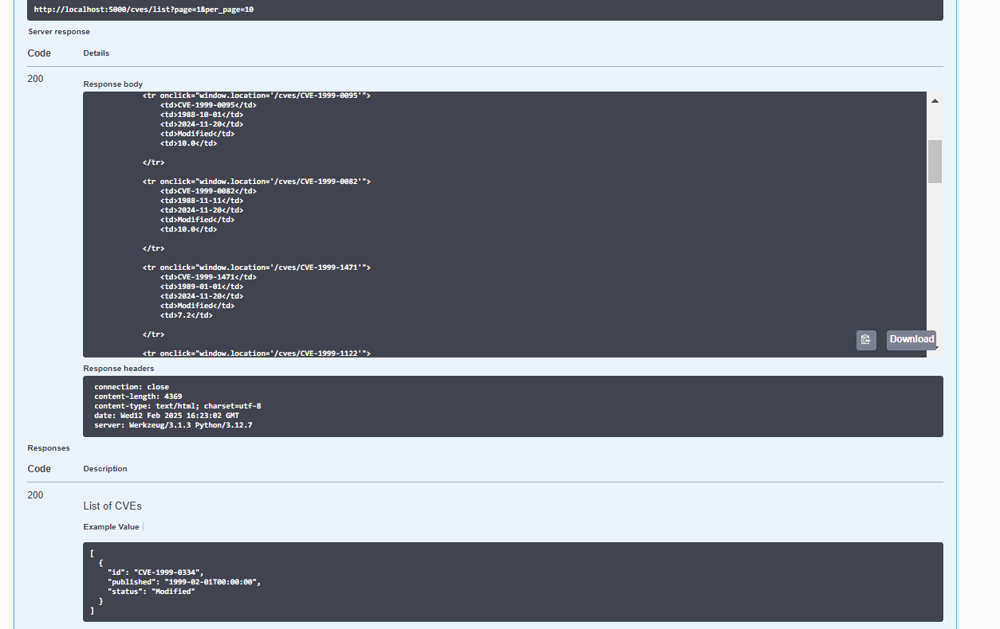
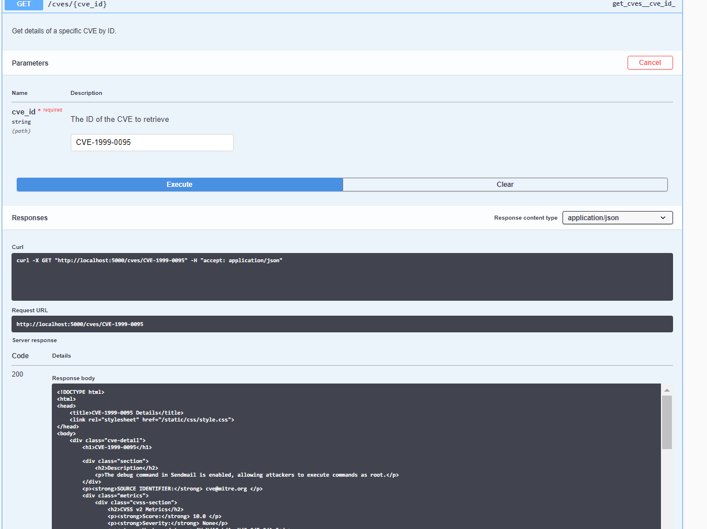

# CVE Dashboard

### Problem Statement
1. Consume CVE data from NVD API and store in database
2. Implement data cleansing/de-duplication
3. Periodic synchronization
4. Develop filtering API endpoints
5. Create web UI with table display
6. Prepare API documentation
7. Write unit tests

A Flask-based web application to fetch, store, and display CVE (Common Vulnerabilities and Exposures) data from the NVD (National Vulnerability Database) API.We have used Python as our primary programming language ,sqlite for database storage,flask for backend synchronisation and html,css and javascript for front end .

## Features
- **Automated Data Sync**: Periodic synchronization with NVD API
- **RESTful API**: JSON endpoints for CVE data access
- **Interactive UI**: 
  - Tabular CVE listing with pagination
  - Detailed CVE view with CVSS metrics
  - Sorting and filtering capabilities
- **Data Management**:
  - SQLite database storage
  - Automatic deduplication
  - Null value cleanup
- **API Documentation**: Integrated Swagger UI
- **Security**: Input validation and error handling

## Screenshots

## CVE List Page

### CVE List Page pagination

### CVE List Page sorting

## CVE DETAILS PAGE

# API DOCUMENT PAGE

# output ScreenRecord

### Logical Approach
1. **API Consumption**: 
   - Use offset-based pagination (`startIndex`/`resultsPerPage`)
   - Handle rate limits (6s delay between requests)
   - Process data in batches (2000 records/batch)

2. **Data Processing**:
   - Clean data (handle missing fields)
   - Deduplicate the Fields
   - Convert dates to datetime objects
   - Extract CVSS metrics from nested JSON
   - Validate mandatory fields (CVE ID, dates)

3. **Database Design**:
   - SQLite for simplicity
   - Table: `cve` with relationships
   - Indexes on frequently queried fields

4. **Synchronization**:
   - Full refresh mode
   - Track last modified dates
  

5. **API Endpoints**:
   - Filter by CVE ID/year/score/modified date
   - Pagination support
   - Sorting parameters

6. **Web UI**:
   - Table view with server-side rendering
   - Clickable rows for details
   - Dynamic pagination controls

7. **Testing**:
   - Unit tests for API parsing
   - Database operation tests
   - UI component tests
## Setup Guide
### Create virtual environment
python -m venv venv
venv\Scripts\activate     # Windows

### Install dependencies 
pip install -r requirements.txt

### Initialize database 
python init_db.py
### synchronize database
python sync_cves.py

### Start the application 
python run.py

### Usage
**Web Interface:** http://localhost:5000/cves/list

**API Documentation:** http://localhost:5000/apidocs/

**API Endpoints:**

GET /api/cves - List all CVEs

GET /api/cves/<cve_id> - Get specific CVE details

## Tech Stack
**Backend:** Python, Flask, SQLAlchemy  
**Frontend:** HTML5, CSS3, Vanilla JS  
**Database:** SQLite (Production: PostgreSQL-ready)  
**DevOps:** Git, pytest, Flask-Migrate  
**APIs:** NVD CVE API v2.0
**API DOCUMENTATION** Flasgger
## Database Schema

### CVE Model
class CVE(db.Model):
    __tablename__ = 'cve'
    id = db.Column(db.String(20), primary_key=True)
    published = db.Column(db.DateTime)
    last_modified = db.Column(db.DateTime)
    source_Identifier = db.Column(db.String(100))
    description = db.Column(db.Text)
    base_score_v2 = db.Column(db.Float)
    base_score_v3 = db.Column(db.Float)
    cvss_v2_vector = db.Column(db.String(100))
    cvss_v2_severity = db.Column(db.String(50))
    cvss_v3_vector = db.Column(db.String(100))
    cvss_v3_severity = db.Column(db.String(20))
    exploitability_score = db.Column(db.Float)
    impact_score = db.Column(db.Float)
    cpe_list = db.Column(db.JSON)
    status = db.Column(db.String(50))
    
## Security
API rate limiting

Input validation/sanitization
## Testing 
Run unit tests:
python -m pytest tests/

## Acknowledgments

- National Vulnerability Database (NVD) for providing the CVE data
- Flask and SQLAlchemy communities for excellent documentation

Prepared statements for SQL

Environment variables for secrets  

