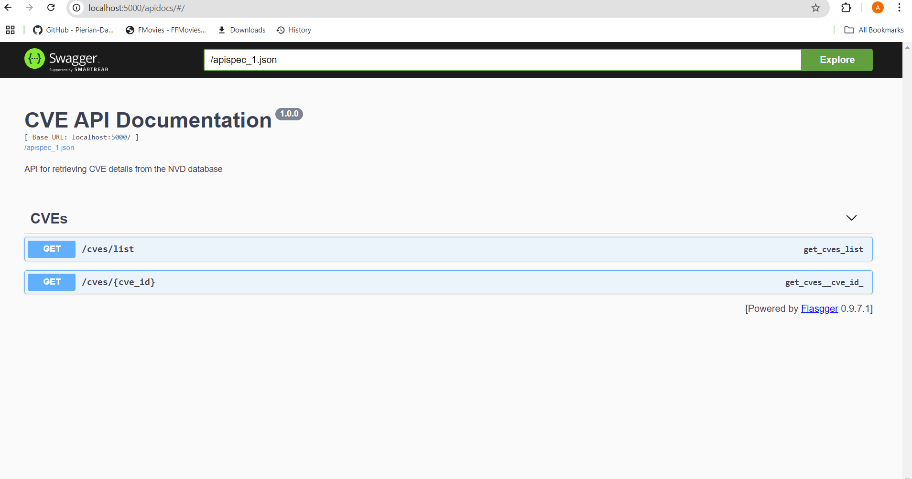

# CVE Dashboard

A Flask-based web application to fetch, store, and display CVE (Common Vulnerabilities and Exposures) data from the NVD (National Vulnerability Database) API.We have used Python as our primary programming language ,sqlite for database storage,flask for backend synchronisation and html,css and javascript for front end .

## Features
- Fetches CVE data from NVD API with pagination
- Stores data in SQLite database
- Data synchronization with periodic updates
- Web UI with filtering/pagination
- Detailed CVE view with CVSS metrics
- Server-side sorting and filtering
- API endpoints for data access
- Unit tests
- Error handling and logging

### Problem Statement
1. Consume CVE data from NVD API and store in database
2. Implement data cleansing/de-duplication
3. Periodic synchronization
4. Develop filtering API endpoints
5. Create web UI with table display
6. Prepare API documentation
7. Write unit tests

## Screenshots

## CVE List Page
### CVE List Page pagination

### CVE List Page sorting

## CVE DETAILS PAGE

## API DOCUMENT PAGE

## output ScreenRecord

## Key Features
- Real-time synchronization with NVD API (280K+ CVEs)
- REST API endpoints with filtering capabilities
- Interactive web interface with sorting/pagination
- SQLite database with data cleansing/de-duplication
- Automated batch updates (incremental/full refresh)
- Chunk Processing: 2000 records/request with retry logic
  

### Logical Approach
1. **API Consumption**: 
   - Use offset-based pagination (`startIndex`/`resultsPerPage`)
   - Handle rate limits (6s delay between requests)
   - Process data in batches (2000 records/batch)

2. **Data Processing**:
   - Clean data (handle missing fields)
   - Convert dates to datetime objects
   - Extract CVSS metrics from nested JSON
   - Validate mandatory fields (CVE ID, dates)

3. **Database Design**:
   - SQLite for simplicity
   - Table: `cve` with relationships
   - Indexes on frequently queried fields

4. **Synchronization**:
   - Full refresh mode
   - Track last modified dates
  

5. **API Endpoints**:
   - Filter by CVE ID/year/score/modified date
   - Pagination support
   - Sorting parameters

6. **Web UI**:
   - Table view with server-side rendering
   - Clickable rows for details
   - Dynamic pagination controls

7. **Testing**:
   - Unit tests for API parsing
   - Database operation tests
   - UI component tests
## Setup Guide
### Create virtual environment
python -m venv venv
venv\Scripts\activate     # Windows

### Install dependencies 
pip install -r requirements.txt

### Initialize database 
python init_db.py
### synchronize database
python sync_cves.py

### Start the application 
python run.py

## Tech Stack
**Backend:** Python, Flask, SQLAlchemy  
**Frontend:** HTML5, CSS3, Vanilla JS  
**Database:** SQLite (Production: PostgreSQL-ready)  
**DevOps:** Git, pytest, Flask-Migrate  
**APIs:** NVD CVE API v2.0
**API DOCUMENTATION** Flasgger
## Database Schema

### CVE Model
class CVE(db.Model):
    __tablename__ = 'cve'
    id = db.Column(db.String(20), primary_key=True)
    published = db.Column(db.DateTime)
    last_modified = db.Column(db.DateTime)
    source_Identifier = db.Column(db.String(100))
    description = db.Column(db.Text)
    base_score_v2 = db.Column(db.Float)
    base_score_v3 = db.Column(db.Float)
    cvss_v2_vector = db.Column(db.String(100))
    cvss_v2_severity = db.Column(db.String(50))
    cvss_v3_vector = db.Column(db.String(100))
    cvss_v3_severity = db.Column(db.String(20))
    exploitability_score = db.Column(db.Float)
    impact_score = db.Column(db.Float)
    cpe_list = db.Column(db.JSON)
    status = db.Column(db.String(50))
    
## File Explanations

### 1. `app/__init__.py`
Initializes Flask application and database connection by creating a flask app instance and configures sqlAlchemy.

### 2. `app/config.py`
Contains configuration settings for the application such as the database uri,api endpoints,rate limiting etc

### 3. `app/models.py`
Defines database models using SQLAlchemy ORM.

## Security
API rate limiting

Input validation/sanitization

## Acknowledgments

- National Vulnerability Database (NVD) for providing the CVE data
- Flask and SQLAlchemy communities for excellent documentation

Prepared statements for SQL

Environment variables for secrets  

